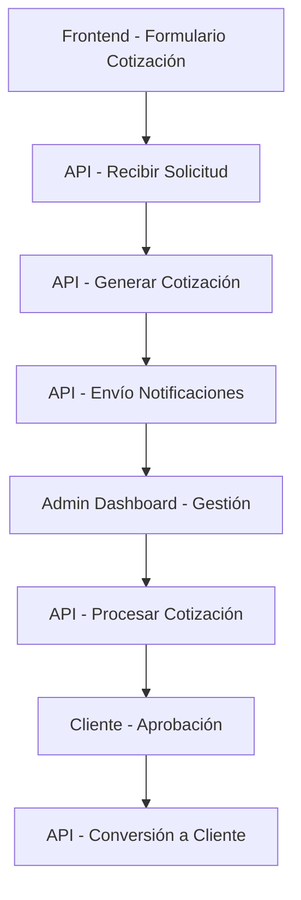

# API ElectricAutomaticChile


API REST para la gestión integral de cotizaciones eléctricas y servicios automatizados de Electricautomaticchile. Esta API proporciona un sistema completo de gestión de cotizaciones, clientes, usuarios y comunicaciones para servicios eléctricos especializados.

## 🎯 Propósito

La API ElectricAutomaticChile fue diseñada para:

- **Gestionar cotizaciones eléctricas** con un flujo completo desde solicitud hasta conversión a cliente
- **Administrar clientes y usuarios** con diferentes roles y permisos
- **Manejar comunicaciones** a través de mensajes y notificaciones
- **Proveer servicios backend** para el frontend de la aplicación web
- **Automatizar procesos** de cotización y seguimiento de servicios eléctricos

## 🏗️ Arquitectura

### Conexión con Frontend

Esta API está diseñada para trabajar en conjunto con el frontend de ElectricAutomaticChile:

- **Frontend**: Aplicación React/Next.js alojada en AWS Amplify
- **Comunicación**: API REST con autenticación JWT
- **CORS configurado** para dominios de producción y desarrollo
- **Endpoints públicos** para formularios de contacto
- **Endpoints privados** para administración y gestión

### Flujo Principal



## 🚀 Características Principales

### 🔐 Sistema de Autenticación

- Login con JWT (JSON Web Tokens)
- Refresh tokens para sesiones extendidas
- Autenticación por email o número de cliente
- Múltiples roles: Admin, Empresa, Cliente

### 📋 Gestión de Cotizaciones

- **Estados del flujo**: Pendiente → En Revisión → Cotizando → Cotizada → Aprobada → Cliente
- **Tipos de servicio**: Reposición, Monitoreo, Mantenimiento, Completa
- **Prioridades automáticas**: Basadas en plazos de entrega
- **Conversión automática** de cotizaciones aprobadas a clientes

### 👥 Administración de Usuarios

- **Superadmin**: Control total del sistema
- **Empresa**: Gestión de cotizaciones y clientes
- **Cliente**: Acceso a sus cotizaciones y servicios

### 📨 Sistema de Comunicaciones

- Mensajería interna entre usuarios
- Notificaciones push y en tiempo real
- Emails automatizados con templates
- Sistema de documentos y archivos adjuntos

### 📊 Dashboard y Reportes

- Estadísticas de cotizaciones por estado
- Métricas de conversión
- Filtros avanzados y paginación
- Búsqueda de texto completo

## 🛠️ Stack Tecnológico

### Backend

- **Node.js** v22.13.1+ con TypeScript
- **Express.js** para el servidor HTTP
- **MongoDB** con Mongoose ODM
- **JWT** para autenticación
- **bcrypt** para encriptación de contraseñas
- **Resend** para envío de emails

### Seguridad y Middleware

- **Helmet** para headers de seguridad
- **CORS** configurado para múltiples dominios
- **Morgan** para logging de requests
- **Rate limiting** y validación de datos

### DevOps y Deployment

- **Docker** multi-stage build
- **Docker Compose** para desarrollo local
- **MongoDB Atlas** para producción
- **AWS App Runner** para deployment

## 📦 Instalación y Configuración

### Prerrequisitos

- Node.js 18.0.0 o superior
- MongoDB 7.0 o superior
- Docker y Docker Compose (opcional)

### Instalación Local

1. **Clonar el repositorio**

```bash
git clone <repository-url>
cd api-electricautomaticchile
```

2. **Instalar dependencias**

```bash
npm install
```

3. **Configurar variables de entorno**

```bash
cp .env.example .env
# Editar .env con tus configuraciones
```

4. **Iniciar en modo desarrollo**

```bash
npm run dev
```

### Variables de Entorno Requeridas

```env
# Base de datos
MONGODB_URI=mongodb://localhost:27017/electricautomatic

# JWT
JWT_SECRET=tu_jwt_secret_super_seguro
JWT_REFRESH_SECRET=tu_refresh_secret_super_seguro

# Email (Resend)
RESEND_API_KEY=tu_resend_api_key

# Frontend
FRONTEND_URL=http://localhost:3000

# Servidor
PORT=4000
NODE_ENV=development
```

## 🐳 Docker

### Desarrollo con Docker Compose

```bash
# Construir e iniciar servicios
docker-compose up --build

# Solo la base de datos
docker-compose up mongo

# Modo desarrollo con hot reload
npm run dev
```

### Producción con Docker

```bash
# Construir imagen
docker build -t api-electricautomatic .

# Ejecutar contenedor
docker run -p 4000:4000 --env-file .env api-electricautomatic
```

## 📚 Documentación

La documentación completa está disponible en la carpeta `docs/`:

- [`docs/endpoints/`](./docs/endpoints/) - Documentación detallada de todos los endpoints
- [`docs/models/`](./docs/models/) - Esquemas de base de datos y modelos
- [`docs/docker/`](./docs/docker/) - Guías de Docker y deployment

## 🚀 Deployment

### AWS App Runner

El proyecto incluye `apprunner.yaml` para deployment automático en AWS App Runner.

### Docker

Imagen Docker optimizada con multi-stage build para reducir tamaño y mejorar seguridad.

### MongoDB Atlas

Configurado para trabajar con MongoDB Atlas en producción con conexiones seguras.

## 🧪 Testing

```bash
# Ejecutar tests (placeholder)
npm test

# Linting
npm run lint

# Build para producción
npm run build
```

## 📋 Scripts Disponibles

- `npm run dev` - Desarrollo con hot reload
- `npm run build` - Build para producción
- `npm start` - Iniciar servidor de producción
- `npm run build:watch` - Build en modo watch

## 🤝 Contribución

1. Fork el proyecto
2. Crea una rama para tu feature (`git checkout -b feature/AmazingFeature`)
3. Commit tus cambios (`git commit -m 'Add some AmazingFeature'`)
4. Push a la rama (`git push origin feature/AmazingFeature`)
5. Abre un Pull Request

## 📄 Licencia

Este proyecto está bajo la Licencia ISC. Ver `package.json` para más detalles.

## 🆘 Soporte

Para soporte técnico o consultas sobre la API:

- **Health Check**: `GET /health` - Verificar estado del servidor
- **Logs**: Revisar logs del servidor para debugging
- **Documentación**: Consultar [`docs/`](./docs/) para guías detalladas

---

**ElectricAutomaticChile API** - Potenciando la gestión de servicios eléctricos con tecnología moderna.
